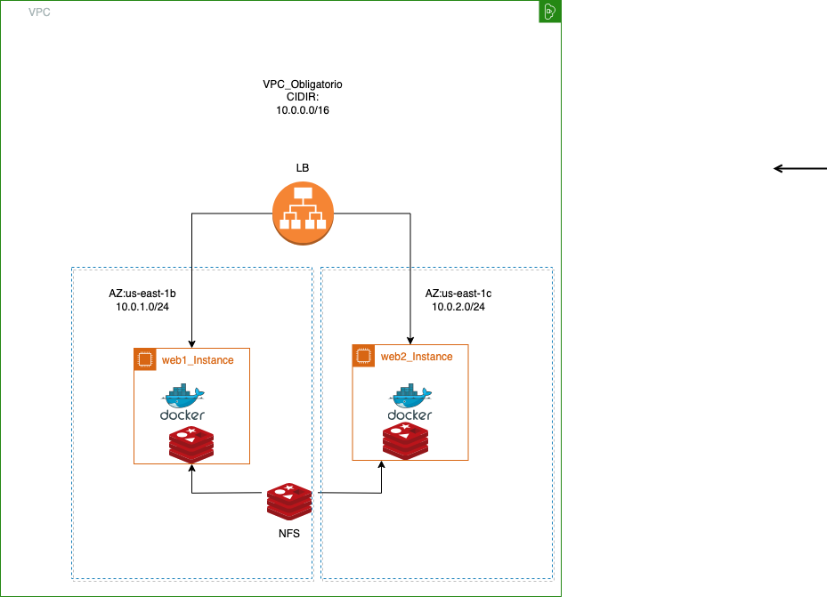

  

La aplicación MJ Sports es una demostración de una arquitectura de microservicios nativa de la nube. Está compuesta por una aplicación
de microservicios de 11 niveles, la cual es una sofisticada plataforma de comercio electrónico basada en la web. Dentro de esta plataforma,
los clientes experimentan una experiencia de compra sin problemas, lo que les permite navegar por una amplia gama de artículos deportivos.
Mientras navegan por la aplicación, los clientes podrán agregar los productos deseados a su carrito de compras y completar sus compras de
forma segura y fácil. Con esta aplicación, MJ Sports satisface las necesidades de sus clientes y les proporciona una interfaz fácil de usar.
Esta tecnología también permite la escalabilidad, resiliencia y la agilidad que son tan necesarias en el desarrollo de aplicaciones modernas.

## Imágenes

| Home Page                                                                                                         | Checkout Screen                                                                                                    |
| ----------------------------------------------------------------------------------------------------------------- | ------------------------------------------------------------------------------------------------------------------ |
| [ | [ 

## Arquitectura

MJ Sports está compuesto por 11 microservicios implementados en varios lenguajes de programación. Estos diferentes lenguajes se comunican entre sí a través de gRPC.
gRPC está diseñado para facilitar la comunicación entre diferentes servicios en un entorno distribuido, y admite varios lenguajes de programación diferentes.

Find **Protocol Buffers Descriptions** at the [`./pb` directory](./pb).

| Servicio                                             | Lenguaje      | Descripción                                                                                                                       |
| ---------------------------------------------------- | ------------- | --------------------------------------------------------------------------------------------------------------------------------- |
| [frontend](./src/frontend)                           | Go            | Expone a un servidor HTTP que sirve al sitio web. No requiere registro/inicio de sesión y genera sesiones automáticamente para todos los usuarios. |
| [cartservice](./src/cartservice)                     | C#            | Almacena en Redis los artículos en el carrito de compras del cliente y los recupera.                                              |
| [productcatalogservice](./src/productcatalogservice) | Go            | Proporciona la lista de productos de un archivo JSON, y la capacidad de buscar y obtener productos individuales.                  |
| [currencyservice](./src/currencyservice)             | Node.js       | Convierte precios a todas las monedas. Utiliza valores reales obtenidos del Banco Central Europeo. Es el servicio de mayor QPS (consultas por segundo). |
| [paymentservice](./src/paymentservice)               | Node.js       | Carga la información de la tarjeta de crédito proporcionada con el monto indicado y devuelve un ID de transacción.                |
| [shippingservice](./src/shippingservice)             | Go            | Proporciona estimaciones de costos de envío basadas en el carrito de compras. Envía los artículos a la dirección proporcionada.   |
| [emailservice](./src/emailservice)                   | Python        | Envía un correo de confirmación a los clientes.                                                                                   |
| [checkoutservice](./src/checkoutservice)             | Go            | Recupera el carrito del cliente, prepara el pedido, coordina el pago y envío, y envía la notificación for correo electrónico.     |
| [recommendationservice](./src/recommendationservice) | Python        | Recomienda otros productos basado en lo que hay en el carrito.                                                                    |
| [adservice](./src/adservice)                         | Java          | Proporciona anuncios basados en el contexto de las palabras proporcionadas.                                                       |
| [loadgenerator](./src/loadgenerator)                 | Python/Locust | Envía solicitudes continuamente imitando flujos reales de compras de usuarios al frontend.                                 

                             

La infraestructura creada es simple, escalable, robusta y cumple con las necesidades del cliente. 
Está compuesta por un LB (load balancer) que distribuye la carga de trabajo de manera eficiente hacia las instancias y garantiza un rendimiento óptimo, así como también alta disponibilidad. 
Dos instancias EC2 que contiene todos los servidores de la aplicación y los microservicios.
Además, se usó un Redis en cada instancia, los que están asociados a un share NFS con el objetivo de compartir y sincronizar datos utilizados por las dos instancias de Redis.

 | Diagrama de Arquitectura                                                                                                                                           |    
 | ------------------------------------------------------------------------------------------------------------------------------------------------------------------ |   

 

                                                                                        
Se usa Terraform para la automatización del despliegue de la infraestructura, despliegue de las imágenes y de los contenedores. (Si no automatizamos todo, sacamos lo que no se haga)

La estructura de Terraform para este proyecto se ve como se muestra en la foto.

| Estructura del Proyecto                                                                                           |    
| ----------------------------------------------------------------------------------------------------------------- |   
| [    

En la raíz del directorio “terraform” se encuentran los archivos main.tf, provider.tf, terraform.tfstate y el backup, valores.tfvars y variables.tf.
En el main.tf se realizó la parametrización de todos los datos como source, ami, instance type, name instance, name vpc, vpc cidr, public subnets, las AZ y los nombres de los security groups.
La parametrización es beneficiosa porque si se requiere un cambio en los datos, se va al archivo valores.tfvars, se hace el cambio y luego ese cambio se replica en todos los archivos relacionados. 
En el archivo provider.tf se definio la región y el profile. 
El archivo variables.tf es donde se definieron las variables.
En valores.tfvars es donde se agregaron los valores de esas variables y es de donde se harán los cambios necesarios. 
El archivo terraform.tfstate es muy importante y crítico para el funcionamiento de terraform, así que es importante mantenerlo seguro. Guarda estado actual de los recursos de esta infraestructura, incluyendo identificadores únicos de los recursos, configuraciones aplicadas, dependencias, entre otras cosas, que son necesarias ara administrar y actualizar la infraestructura de manera controlada. 
Además, en la raíz de terraform, se encuentra el directorio modules el cual contiene los datos de la parametrización necesaria para el despliegue automatizado de la infraestructura. También dentro de modules tenemos archivos y directorios. 
El directorio dev_deploy_isc contiene los archivos para el despliegue de la infraestructura.
Archivo instances.tf, acá se indicaron las instancias que se van a crear. Si hay necesidad de crear más instancias se crearan en este archivo. Se crearon web1 y web2. Cada instancia se configuro para hacer lo mismo con mínimas variaciones. En el provisioner se configuró una serie de comandos que hacen lo siguiente,  instala Git, curl, Docker, luego instala docker-compose en su última versión, le da permisos al usuario y lo agrega al grupo Docker. Luego se mueve al directorio del usuario e instala el repositorio de git para luego habilitar e iniciar Docker. Finalmente se mueve al repositorio de Git para ejecutar Docker-compose. 

Nota importante: para quien ejecute las instancias. En “connection”, se debe cambiar el path en el file para que apunte a la private_key de quien sea el ejecutante.

Archivo network.tf, acá es donde se definieron los recursos de red, se parametrizaron los valores. Se definió la VPC, la subnet1 y 2, se definió el Gateway, la default route table para el VPC, también una ruta para el load balancer, se definió el load balancer con sus subnets 1 y 2 además del security group para el lb. Se definieron los listeners en puerto 80, HTTP, y la default action que responde con OK (código 200) si ninguna de las reglas se cumplen cuando recibe una solicitud. También se definió  el web target group, su puerto y protocolo y finalmente los attachments 1 y 2 para crear la asociación entre los grupos de destino y la instancia en el lb.
Archivo security-groups.tf, contiene la configuración para definir y administrar los security groups. Se definieron las reglas de ingreso y salida para las instancias web 1 y 2 y el load balancer.
Archivo variables.tf, contiene las variables que aplican al directorio modules, que están definidas allí.
Dentro de modules, también tenemos el directorio docker-compose, el cual contiene todos los microservicios que serán desplegados por docker-compose.

Nota: se decidió utilizar docker-compose en lugar de Kubernetes por una serie de razones.

1-	El proyecto no requiere un escalamiento masivo, por lo tanto, Docker satisface el nivel de escalamiento requerido y provee otras ventajas que hacen que valga la pena su uso. 
    Se adapta bien al tamaño del proyecto.
    
2-	Kubernetes es bastante más complejo. Docker es más simple en su uso. 

3-	Las fallas en Docker son más fáciles de identificar, ya que contienen menos cosas que pueden fallar.

4-	Los archivos de Docker son en texto plano y se pueden compartir fácilmente, en cambio los archivos de un despliegue de Kubernetes son almacenados en sus manifiestos que utilizan
    un formato más complejo.
    

Docker-compose contiene todos los servicios mencionados en la arquitectura del documento más arriba. Dentro de cada servicio hay un archivo que es importante, el Dockerfile. Se usa para crear imágenes, para instalar software, copiar archivos hasta configuraciones. Todo lo que se quiera modificar o actualizar se va a hacer desde este archivo.

El otro archivo es docker-compose.yml, en la estructura esta fuera de todos los servicios. Es el archivo de configuración utilizado por Docker-compose. En el archivo se describieron los servicios, redes y volúmenes necesarios pare ejecutar la aplicación en este proyecto el cual está compuesto por varios contenedores de Docker. Todos los servicios deben estar presentes en este archivo con detalles de los puertos expuestos, los volúmenes con el path, dependencias y otras configuraciones específicas del servicio. Cuando se ejecute el docker-compose, este archivo va a ser leído para saber dónde levantar las imágenes de cada servicio, para lo cual el path de cada servicio va a apuntar hacia su dockerfile. Este path debe estar correctamente ingresado, de lo contrario se obtendrá un error por respuesta. 
                                                              
